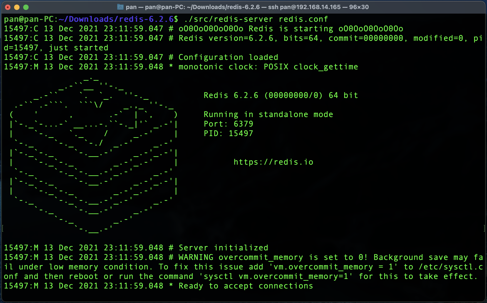
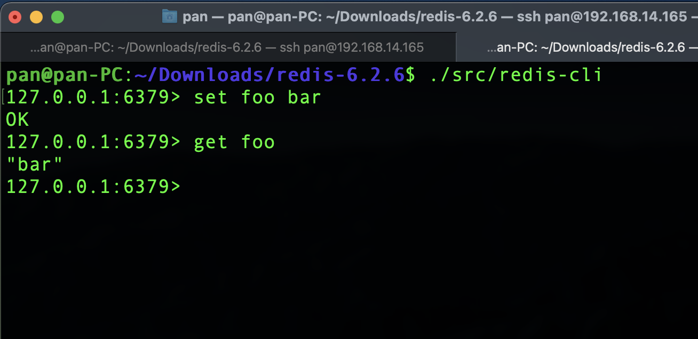
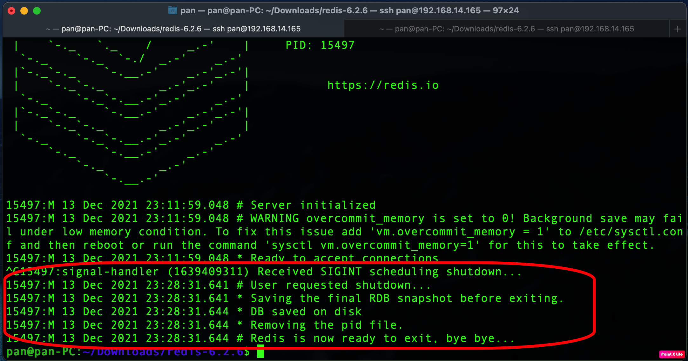
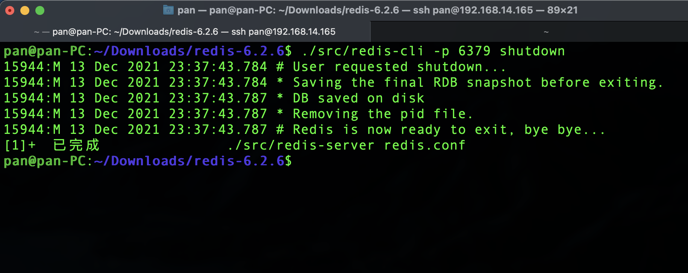

# redis入门知识第2篇-redis的安装与测试

## 1. 概述


在我的上一篇笔记中，介绍了**redis**的一些基本概念。在本文，我们将来安装 **redis** 的学习环境。我们将在Linux环境中安装redis服务，如果你现在没有Linux环境，可以通过这个链接参考Linux虚拟机环境的搭建方法：[使用Multipass快速创建和管理Ubuntu Server虚拟机](https://blog.jkdev.cn/index.php/archives/326/)。


本文是该系列笔记的第2篇，你可以通过下列链接阅读往期的篇章：

- [01-redis入门知识第1篇-redis简介](https://blog.jkdev.cn/index.php/archives/447/)


## 2.安装过程

可以通过以下链接去下载redis的最新源代码

[http://download.redis.io/releases/](http://download.redis.io/releases/)

在撰写这篇文章的时候，redis的最新稳定版本为`6.2.6`，所以我们这次安装6.2.6 版本，安装过程如下

```
wget http://download.redis.io/releases/redis-6.2.6.tar.gz    #下载源代码
tar xzf redis-6.2.6.tar.gz            #解压
cd redis-6.2.6                        #进入源码目录
make                                  #编译
```

使用 make 编译完成后 redis 目录下会出现编译后的 redis 服务程序 redis-server,还有用于测试的客户端程序 redis-cli，编译后生成的可程序位于源码目录下的 src 目录

## 3.测试数据库

进入 redis 目录，执行以下命令启动redis服务：
```shell
./src/redis-server redis.conf    #参数指定配置文件
```

如果看到如下图的提示，代表程序服务启动成功



启动 redis 服务进程后，就可以使用测试客户端程序 redis-cli 和 redis 服务交互了。此时我们打开另一窗口，进入redis的目录，执行如下操作：

```shell
# 启动服务
./src/redis-cli
# 设置 foo 键的值为 bar
redis> set foo bar
# 读取 foo 键的值
redis> get foo
```

如果出现如下图的执行结果，代表安装成功




## 4.关闭数据库服务


在3中，我们使用了 `./src/redis-server redis.conf` 这样的指令开启了redis服务，如果需要关闭，只需要在命令行终端同时按键盘上的 `Ctrl` + `C` 键即可。如下图提示代表redis服务关闭成功





在的实际中的服务器上通常运行很多服务，不仅仅是redis，人们不可能用一只用一个终端一只保持redis一直在前台运行。因此人们通常使用 “后台运行” 的方式启动redis服务。如下命令

```shell
./src/redis-server redis.conf &
```

启动服务之后，只需要再按一次键盘上的`Enter`键，服务即进入了后台运行。我们可以使用 `redis-cli -p 端口号 shutdown` 的命令格式关闭服务，如下：

```shell
./src/redis-cli -p 6379 shutdown
```

如下图提示内容，代表服务关闭成功




## 5.修改配置文件 redis.conf

以下列举resdis安装后最常用的两个配置

### （1）设置支持远程访问：
找到以下一行

```shell
bind 127.0.0.1
```

注释当前行即可支持远程登录

```shell
# bind 127.0.0.1
```

### （2）默认没有密码，设置密码：
找到下面一行

```shell
# requirepass foobared
```

取消注释，“foobared”就是密码，可以改成其他的，如改成“myredis”


```shell
requirepass myredis
```

重启服务，使用 a 参数传入密码才可以正常操作

```
./src/redis-cli -a myredis
```
