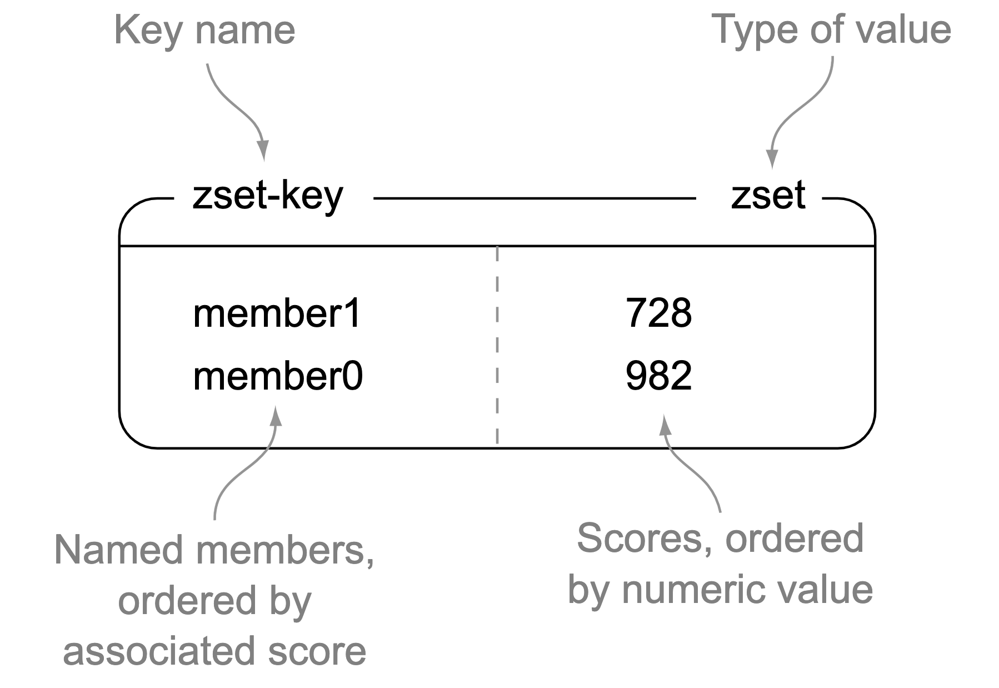
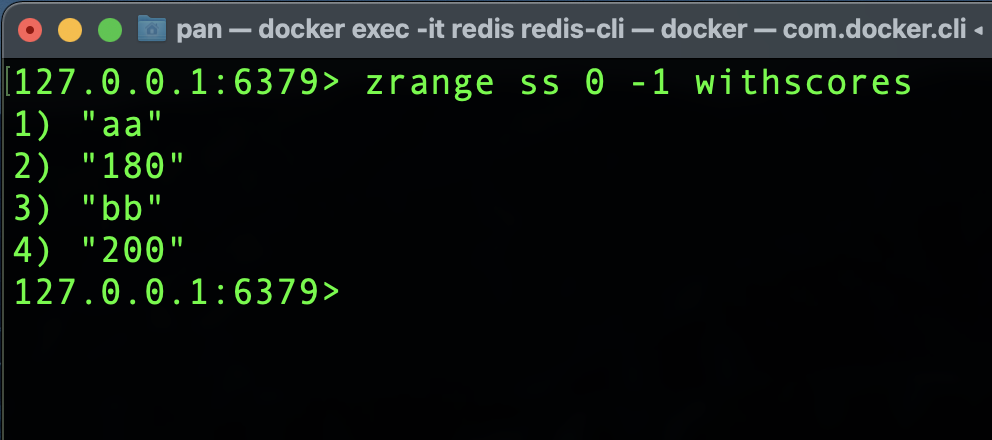
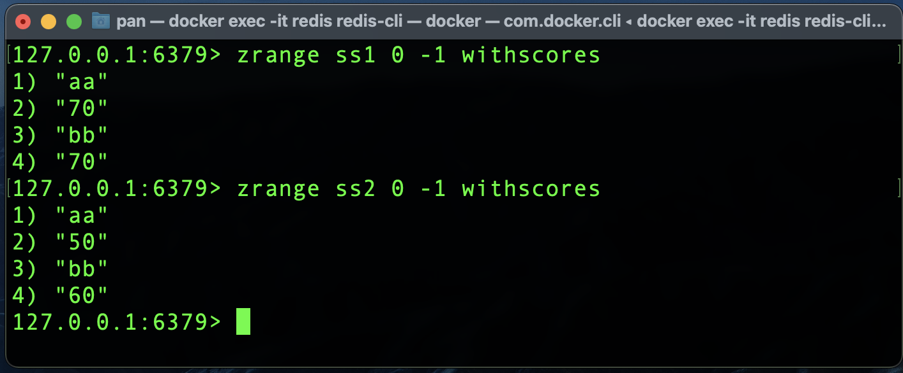

# sorted_set 数据类型与基本操作

## 1. 概述

> 假设我们现在有这样的需求：我们需要对同类数据进行排序，需要提供一种可以根据自身特征进行排序的方式。于是我们引入今天的类型：sorted_set，也叫做有序集合，通常我们也称为 zset，指的是在 redis 中，通常以 zset add 等命令操作。


有序集合可以保存可排序的数据，在set存储结构的基础之上添加可排序字段。有序集合数据结构如下图所示：



`key` 代表集合中的元素， `score` 代表元素对应的排序值。

## 2. sorted_set 数据类型的基本操作

### 2.1. 添加数据

```shell
zadd key score1 member1 [score2 member2]
```

### 2.2. 获取全部数据

```shell
# 顺序排列取数据
zrange key start stop [withscores]
# 倒叙排列取数据
zrevrange key start stop [withscores]
```


### 2.3. 删除数据

```shell
zrem key member [member...]
```

### 2.4. 按条件获取数据

相关符号如下：

**+inf**: 表示大于任何数

**-inf**: 表示小于任何数

**(**: 左开区间

**)**: 右开区间

指令格式
```shell
# 正序 根据score查询 
zrangebyscore key min max [withscores] [limit]
# 倒序 根据score查询
zreverangebyscore key min max [withscores] [limit]
```

查询示例

```shell
# 添加数据
zadd scores 60 li 85 ww 91 zl 88 lxm 82 xsd 66 cc 100 glz 79 zs
# 查询score为80到任意大的3条数据
zrangebyscore scores 80 +inf withscores limit 0 3
# 查询100到60的2条数据
zrevrangebyscore scores 100 60  withscores limit 0 2
```


### 2.5. 按条件删除

```shell
# 根据索引删除数据
zremrangebyrank key start stop
# 根据score删除数据
zremrangebyscore key min max
```


### 2.6. 获取集合总数

```shell
# 获取某个键的集合总数
zcard key
# 获取score范围值的集合总数
zcount key min max
```


### 2.7. 有序集合的交并操作

**指令格式**

```shell
# 将numkey个集合 的交集保存到destination 中，合并之后的新集合中，score值被相加
zinterstore destination numkey key [key1...] 	
# 将numkey个集合 的并集保存到destination 中
zunionstore destination numkey key [key1...]
```


**交集操作指令示例**

我们先执行以下指令添加测试数据

```shell
# 添加数据到s1中
zadd s1 50 aa 60 bb 70 cc
# 添加数据到s2中
zadd s2 60 aa 70 bb 90 cc
# 添加数据到s3中
zadd s3 70 aa 70 bb 100 cc
```

将以上是那个集合的交集保存到 ss 中

```shell
# 求s1、s2、s3的交集 保存到 ss 中
zinterstore ss 3 s1 s2 s3
# 打印 ss 中的数据
zrange ss 0 -1 withscores
```

此时可以看到返回的数据如下图所示




此时我们可以看到每一个字段的score值被相加起来。我们还可以指定交叉的元素 取最大值(max)还是 最小值(min)，而不是 求和值(sum)，如下指令


```shell
# 求 s1、s2、s3 的交集保存到 ss1 中，取交叉元素的最大值
zinterstore ss1 3 s1 s2 s3 aggregate max
# 求 s1、s2、s3 的交集保存到 ss2 中，取交叉元素的最小值
zinterstore ss2 3 s1 s2 s3 aggregate min
```

分别取 ss1 和 ss2 的结果如下入所示




## 3. sorted_set 数据类型的扩展操作

### 3.1. 需求案例


假设有以下的需求

- 各类资源网站TOP 10排行榜（电影、歌曲、文档、电商、游戏等）
- 聊天室的活跃度统计
- 游戏好友亲密度

### 3.2. 解决方案

使用 有序集合 对所有参与排名的资源建立排序依据，相关操作指令如下


**指令格式**

- 获取数据对应索引的排名

```shell
# 根据score 值从小到大正向查询 排名
zrank key member
# 根据score 值从大到小倒向查询 排名
zrevrank key member
```


- score值获取与修改

```shell
# 根据key和member获取score值
zscore key member
# 对 key 中的 member 元素增加 increment 个单位的 score 值 
zincrby key increment member
```

**示例**

```shell
# 添加测试数据
zadd movies 143 aa 97 bb 201 cc
```


## 4. sorted_set 类型数据操作的注意事项

- score 保存的存储空间是64位，如果是整数，数值范围是 -9007199254740992 ~ 9007199254740992
- score 保存的数据也可以是一个双精度的double值，基于双精度浮点数的特征，可能会丢失精度，使用的时候要慎重
- sorted_set 底层存储还是基于set结构的，因此数据不能重复，如果重复添加相同的数据，score值将会被覆盖，保留最后一次保存的结果


## 5. sorted_set 应用于处理定时的顺序任务

- 对于基于时间线限定的任务处理，将处理时间记录为score 值，利用排序功能区分处理的先后顺序；
- 记录下一个要处理的时间，当到期后处理对应的任务，任务处理完成之后移除redis中对应的记录，并记录下一个要处理的时间；
- 当新任务加入时，判定并更新下一个要处理的任务时间；
- 为了提升sorted_set的性能，通常将任务根据特征存储成若干个sorted_set。例如一小时内、一天内、一周内、一个月内、季度内、年度内等，操作时逐级提升，将即将操作的若干个任务纳入到1小时内处理的队列中。


redis中获取系统时间的指令
```shell
time
```

## 6. sorted_set 应用于处理有权重的队列任务

### 6.1. 普通权重任务的处理

当任务或者消息待处理，形成了任务队列或者消息队列时，对于高优先级的任务要保障对其优先处理。我们利用sorted_set的特征，即可解决这个问题。对于有权重的任务，优先处理权重高的任务，采用score记录权重即可。如下指令

添加测试数据

```shell
# 添加权重为 4 的id为105订单任务
zadd tasks 4 order:id:105
# 添加权重为 9 的id为425订单任务
zadd tasks 9 order:id:425
# 添加权重为 1 的id为1345订单任务
zadd tasks 1 order:id:345
```

根据权重从高到低查询任务列表

```shell
zrevrange tasks 0 -1 withscores
```

在实际的场景中，我们往往挨条任务取出来处理，使用下面的指令取出第一个任务
```shell
zrevrange tasks 0 0 withscores
```

我们得到的任务元素是 `order:id:425` ，任务处理完成之后，将对应元素移除即可，如下指令

```shell
zrem tasks order:id:425
```

不过，以上的操作不是原子性（要么全部执行成功要么全部执行失败）的，我们这里暂且不讨论非原子性操作带来的后果，后面的章节会说明。


### 6.2. 多重权重任务的处理

如果权重条件过多时，需要对排序score值进行处理，保障score值能够兼容2个条件或者多个条件，例如外贸订单优先于国内订单，总裁订单优先于员工订单，经理订单优先于员工订单。解决方案如下：


- 因score长度受限，需要对数据进行截断处理，尤其是时间设置为小时或分钟级别即可
- 先设定订单列表，后设定发起角色类别，整体score长度必须是统一的，不足则补0。第一排序规则首位不得是0

示例：外贸101，国内102，经理104，员工008。那么员工下的外贸单为101008，经理下的国内订单为102004


