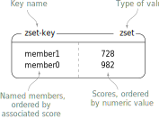

# sorted set 数据类型与基本操作

## 1. 概述

> 假设我们现在有这样的需求：我们需要对同类数据进行排序，需要提供一种可以根据自身特征进行排序的方式。于是我们引入今天的类型：sorted set，也叫做有序集合。


有序集合可以保存可排序的数据，在set存储结构的基础之上添加可排序字段。有数集合数据结构如下图所示：




## 2. sorted set 数据类型的基本操作

### 2.1. 添加数据

```shell
zadd key score1 member1 [score2 member2]
```

### 2.2. 获取全部数据

```shell
# 顺序排列取数据
zrange key start stop [withscores]
# 倒叙排列取数据
zrevrange key start stop [withscores]
```


### 2.3. 删除数据

```shell
zrem key member [member...]
```

### 2.4. 按条件获取数据

相关符号如下：

**+inf**: 表示大于任何数
**-inf**: 表示小于任何数
**(**: 左开区间
**)**: 右开区间

指令格式
```shell
# 正序 根据score查询 
zrangebyscore key min max [withscores] [limit]
# 倒序 根据score查询
zreverangebyscore key min max [withscores] [limit]
```

查询示例

```shell
# 添加数据
zadd scores 60 li 85 ww 91 zl 88 lxm 82 xsd 66 cc 100 glz 79 zs
# 查询score为80到任意大的3条数据
zrangebyscore scores 80 +inf withscores limit 0 3
# 查询100到60的2条数据
zrevrangebyscore scores 100 60  withscores limit 0 2
```


### 2.5. 按条件删除

```shell
# 根据索引删除数据
zremrangebyrank key start stop
# 根据score删除数据
zremrangebyscore key min max
```


### 2.6. 获取集合总数

```shell
# 获取某个键的集合总数
zcard key
# 获取score范围值的集合总数
zcount key min max
```


### 2.7. 有序集合的交并操作

指令格式

```shell
# 将numkey个数据 交集保存到destination 中
zinterstore destination numkey key [key1...] 	
# 将numkey个数据并集 保存到destination 中
zunionstore destination numkey key [key1...]
```